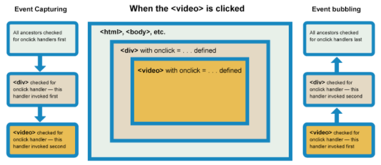

# 0527

## 创建JavaScript代码块

<https://developer.mozilla.org/zh-CN/docs/Learn/JavaScript/Building_blocks>

- if-else switch
- 循环：for while
- 基本函数
- 事件
- 事件冒泡与事件捕获

### 回顾答疑

___

- 提取字符串
**slice(start[,end])** *注：* 可为负索引，不修改原String和Array
`问： String的slice方法和Array中的slice方法有设区别？`
 String.slice(start,end) 返回起止下标之间的字符；
 Array.slice(start,end) 返回起止下标之间的元素组成的数组，不修改原数组，返回一个子数组;

- 替换
**replace()** *注：* 只替换首个匹配；可使用正则表达式匹配字符
`问：全部替换应该怎么做`

        // 使用正则表达式 /g 全局搜索匹配
         let str = 'my test replaceAll my test.'
        let newStr = str.replace(/my/g,'your');
        console.log(str);
        console.log(newStr);

### 1. 条件——switch

___

实例：theme.html

### 2. break和continue

___

**break**   立即退出循环
**continue**    结束当前循环，转而执行下一个循环

### 3. 事件

___

- 事件处理器属性
    例如：
    btn.oncilick = function(){};
    onfocus、onblur、onchange、onmouseover、onmouseout

        const btn = document.querySelector('button');
        btn.onclick = function() {
        const rndCol = 'rgb(' + random(255) + ',' + random(255) + ',' + random(255) + ')';
        document.body.style.backgroundColor = rndCol;
        }

- 行内事件处理器 ***（勿用）***

- addEventListener()和removeEventListener()
    参数1：`事件`     参数2：`执行的操作`
    随机背景颜色转换代码：

        const btn = document.querySelector('button');
        function bgChange() {
          const rndCol = 'rgb(' + random(255) + ',' + random(255) + ',' + random(255) + ')';
          document.body.style.backgroundColor = rndCol;
        }
        btn.addEventListener('click', bgChange);

#### 其他事件

在处理函数内部，会有一个固定指定名称的参数。例如`event` ， `evt` ， `e`。被称为事件对象

    function bgChange(e) {
      const rndCol = 'rgb(' + random(255) + ',' + random(255) + ',' + random(255) + ')';
      e.target.style.backgroundColor = rndCol;
      console.log(e);
     }
     btn.addEventListener('click', bgChange);

### 4. 事件冒泡及事件捕获

___

捕获阶段：

- 浏览器检查元素的最外层祖先<html>，是否在捕获阶段中注册了一个onclick事件处理程序，如果是，则运行它。
- 然后，它移动到<html>中单击元素的下一个祖先元素，并执行相同的操作，然后是单击元素再下一个祖先元素，依此类推，直到到达实际点击的元素。

冒泡阶段: ***(默认情况下)***

- 浏览器检查实际点击的元素是否在冒泡阶段中注册了一个onclick事件处理程序，如果是，则运行它
- 然后它移动到下一个直接的祖先元素，并做同样的事情，然后是下一个，等等，直到它到达<html>元素。

## Array详解

<https://developer.mozilla.org/zh-CN/docs/Web/JavaScript/Reference/Global_Objects/Array>
___

### 1. 遍历数组 forEach()

    var fruits = ['Apple', 'Banana'];
    fruits.forEach((item, index, Array) => {
      console.log(index, item);
    })

### 2. 删除、替换现有元素或原地添加新的元素 splice()

语法：**`array.splice(start[, deleteCount[, item1[, item2[, ...]]]])`**
`start`起始位置
`deleteCount`删除的元素个数
`item`添加的元素

返回值：删除——输出删除的元素组成的数组；否则返回空数组

    const months = ['Jan', 'March', 'April', 'June'];
    // 添加
    months.splice(1, 0, 'Feb'); // inserts at index 1
    console.log(months);  // expected output: Array ["Jan", "Feb", "March", "April", "June"]
    // 删除
    months.splice(4, 1);  // replaces 1 element at index 4
    console.log(months);  // expected output: Array ["Jan", "Feb", "March", "April"]
    // 替换
    months.splice(1,1,'2');
    console.log(months);  // expected output: Array ["Jan", "2", "March", "April"]

### 3. 复制一个数组 slice()

    let newFruits = fruits.slice();

### 4. 查找第一个满足测试函数的元素 find()

返回元素的值 **find()**
返回元素的索引 **findIndex()**  

    const array1 = [12, 7, 99, 34];
    let found = array1.find(element => element>10);
    console.log(found);  // 12
    let foundIndex = array1.findIndex(element => element<10);
    console.log(foundIndex);  // 1

### 5. 创建新数组 map()

返回值为一个原数组每个元素执行回调函数的结果组成的新数组

    const array2 = [1, 3, 4, 6, 9];
    let doubleArray = array2.map(element => element*2);
    console.log(doubleArray); // [1, 9, 36, 81]

## Object详解

<https://developer.mozilla.org/zh-CN/docs/Web/JavaScript/Reference/Global_Objects/Object>
___
