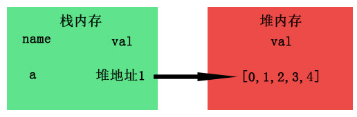
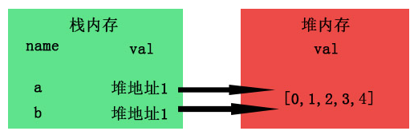
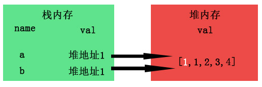
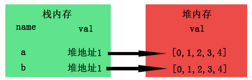
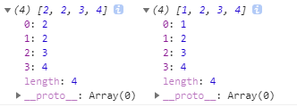
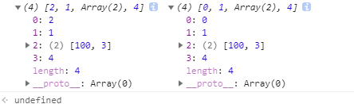

# 0528

## 回顾答疑

**`2. 问：深拷贝与浅拷贝的差别`**

- 浅拷贝
  - 基本数据类型（number, string, boolean, null, undefined）：
    名值存储在栈内存中，值引用，实际上内存引用，指向了某一处内存的值

        let a = 1;
        let b = a;

    <table>
        <tr >
            <th bgcolor = green colspan = "2">栈内存</th>
        </tr>
        <tr>
            <td>name</td>
            <td>val</td>
        </tr>
        <tr>
            <td>a</td>
            <td>1</td>
        </tr>
    </table>

    复制 b=a ,栈内会新开辟一块内存
     <table>
        <tr >
            <th bgcolor = green colspan = "2">栈内存</th>
        </tr>
        <tr>
            <td>name</td>
            <td>val</td>
        </tr>
        <tr>
            <td>a</td>
            <td>1</td>
        </tr>
        <tr>
            <td>b</td>
            <td>1</td>
        </tr>
    </table>
    此时修改a的值，此时不会改变b的值

  - 引用数据类型（Object, Array, Date）:
     名存在栈内存中，值存在堆内存中，栈内存会提供一个引用的地址指向堆内存中的值。数组指向了同一处内存的值，如果 该处内存值发生了变化，浅拷贝的赋值变量值也会改变。

            let myArr = [0, 1, 2, 3, 4];
            let newArr = myArr;
            a[0] = 1;

     
     当newArr = myArr进行拷贝时，复制myArr的引用地址
     
     修改数组myArr的值，newArr也会改变
     

- 深拷贝
 则是指从原数组内存处取出值，重新赋值到一块新的内存中，原数组值的修改不会影响到新的数组。
 
 slice concat深拷贝过程

        let a=[1,2,3,4],
            b=a.slice();
        a[0]=2;
        console.log(a,b);

  

        let a=[0,1,[2,3],4],
        b=a.slice();
        a[0]=2;
        a[2][0] = 100;
        console.log(a,b);

  
  b对象的一级属性确实是深拷贝的过程，拥有独立的内存。但是二级属性还是公用了地址，所以还是浅拷贝的过程。
  **综上：slice concat是不完全的深拷贝**

**`4. const arr3 = arr1.concat(arr2)修改 arr1之后arr3会有影响吗？修改arr2呢？`**

- cancat返回一个新数组，修改原数组，arr3不变；深拷贝过程

**`5. 在对数组遍历过程中 在forEach遍历中，break/return会有什么影响吗？`**

- 在foreach中是不能通过break continue return来终止循环,会报错

### 1. 箭头函数

<https://developer.mozilla.org/zh-CN/docs/Web/JavaScript/Reference/Functions/Arrow_functions>

- 基础语法

        // 传递多个参数
        (param1, param2, …, paramN) => { statements }
        (param1, param2, …, paramN) => expression;  //相当于：(param1, param2, …, paramN) =>{ return expression; }
        // 当只有一个参数时，圆括号是可选的：
        (singleParam) => { statements }
        singleParam => { statements }
        // 没有参数的函数应该写成一对圆括号。
        () => { statements }
        // 声明函数 用const更命名，方便调用
        const setTheme = ()=>{}
        setTheme();  // 函数调用和执行

- 特点
  - 没有自己的`this`，`arguments`， `super`，`new.target`
  - 适用于匿名函数
  - 不能用作构造函数
  - 箭头函数不会创建自己的this，它只会从自己的作用域链的上一层继承this

## ES6

<https://es6.ruanyifeng.com/>

### 1. let 和 const

___
**`let`**

- 暂时性死区（temporal dead zone，简称 TDZ）：在代码块内，使用let命令声明变量之前，该变量都是不可用的。
 ES6 明确规定，如果区块中存在let和const命令，这个区块对这些命令声明的变量，从一开始就形成了封闭作用域。凡是在声明之前就使用这些变量，就会报错。
 ***注：*** typeof会因为TDZ出现错误

            typeof x;  // ReferenceError
            let x;
            typeof y; //undefined

- 不存在变量提升。`var`声明变量可以在声明之前使用，值为**undefined**；`let`声明变量可以在声明之前使用会**报错**
- 不允许在系统作用域内，重复声明同一个变量

**`const`**

- 声明一个只读变量，一旦声明，常量值不能改变，且一旦声明，必须立即初始化。只声明不赋值会报错
- *其他性质同 let*
