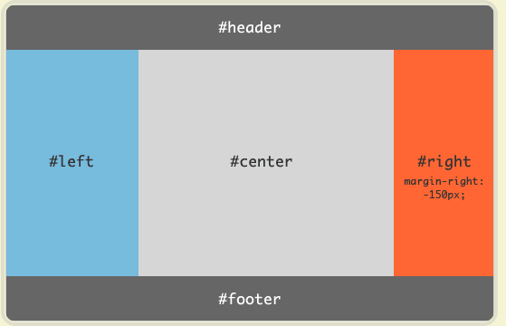

# 0601

## Flex布局:实例篇

<https://www.ruanyifeng.com/blog/2015/07/flex-examples.html>
基准线：

### 1. 骰子布局

实例：touzi.html + touzi.css

### 2. 网格布局

- 基本网格布局——平均分布
- 百分比布局，其余网格平均分配剩余空间
- 圣杯布局  shengbei.html
 
- 输入框布局
- 悬挂式布局
- 固定的底栏
- 流式布局

## 知识点回顾

<https://juejin.cn/post/6844903922084085773>

### 1. 在浏览器输入URL回车之后发生了什么（ `HTTP（端口80）` 请求）？

1. URL解析

    - 地址解析：判断输入的URL是否合法
    - HSTS 会强制可会断使用HTTPS（端口403）访问页面
    - 检查缓存
    

2. DNS查询

    - 基本步骤
    
      - 检查浏览器缓存，无则调用系统库函数进行查询
      - OS的DNS缓存：检查域名是否在本地的Hosts文件里，无则向DNS服务器发送查询请求
      - 路由器缓存
      - ISP DNS缓存
      - 根域名服务器查询
      

3. TCP连接

    TCP/IP四层结构
    
    - 应用层：发送 HTTP 请求
    根据得到服务器的 IP 地址，浏览器开始构造一个 HTTP 报文，其中包括：
      - 请求报头（Request Header）：请求方法、目标地址、遵循的协议等等
      - 请求主体（其他参数）
    ***注意点：***
    浏览器只能发送 `GET`、`POST` 方法，打开网页使用的是`GET`方法
    - 传输层：TCP 传输报文
    传输层会发起一条到达服务器的 TCP 连接，为了方便传输，会对数据进行分割（以`报文段`为单位），并标记编号，  方便服务器接受时能够准确地还原报文信息。
    在建立连接前，会先进行 TCP 三次握手,结束时四次挥手。
    - 网络层：IP协议查询Mac地址
    将数据段打包，并加入源及目标的IP地址，并且负责寻找传    输路线。
    判断目标地址是否与当前地址处于同一网络中，是的话直接    根据 Mac 地址发送，否则使用路由表查找下一跳地址，以   及使用 ARP 协议查询它的 Mac 地址。
    - 链路层：以太网协议
    **以太网协议**
    根据以太网协议将数据分为以“`帧`”为单位的数据包，每一帧分为两个部分：
    `标头`：数据包的发送者、接受者、数据类型
    `数据`：数据包具体内容
    **Mac 地址**
    以太网规定了连入网络的所有设备都必须具备“网卡”接口，数据包都是从一块网卡传递到另一块网卡，网卡的地址就    是 Mac 地址。每一个 Mac 地址都是独一无二的，具备了    一对一的能力。
    **广播**
    发送数据的方法很原始，直接把数据通过 ARP 协议，向本网络的所有机器发送，接收方根据标头信息与自身 Mac 地址比较，一致就接受，否则丢弃。
    注意：接收方回应是单播。
    - 服务器接受请求
    接受过程就是把以上步骤逆转过来，参见上图。
4. 服务器处理请求

5. 接受响应
    - 查看 Response header，根据不同状态码做不同的事（比如上面提到的重定向）。
    - 如果响应资源进行了压缩（比如 gzip），还需要进行解压。
    - 对响应资源做缓存。
    - 根据响应资源里的 MIME 类型去解析响应内容（比如 HTML、Image各有不同的解析方式）。
6. 熏染页面

7. JavaScript编译执行

